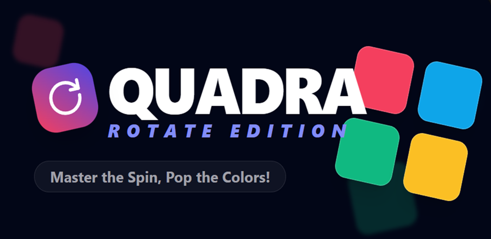
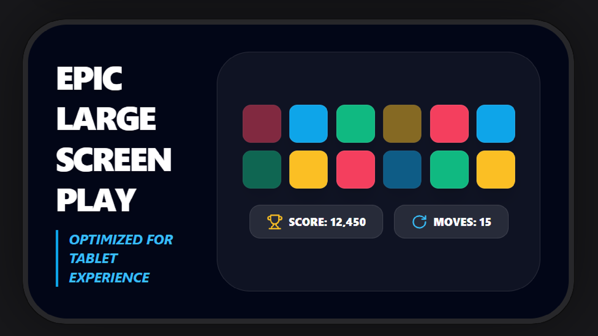
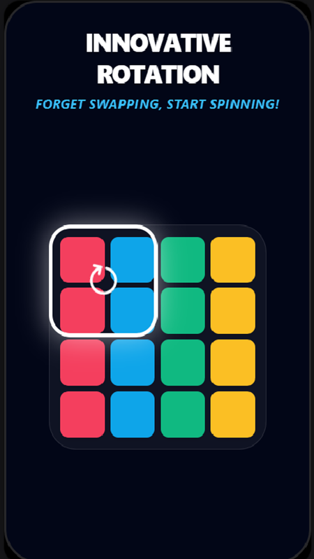

# Quadra Rotate
# Overview
Quadra Rotate is a logic-driven puzzle engine designed to handle complex grid transformations. The project focuses on the mathematical implementation of matrix rotations and maintaining a deterministic system state during user interactions.
# Technical Specifications
- Logic Layer: Implemented custom coordinate transformation algorithms to handle $90^\circ$ and $180^\circ$ rotations.
- State Integrity: Developed a centralized state controller to prevent race conditions during rapid input sequences.
- Validation: Robust boundary checking to ensure all grid movements remain within the defined coordinate system.
# Setup & Installation
To run this project locally, use the following commands in your terminal:
```
# Clone the repository
- git clone [https://github.com/barislkn/quadra-rotate.git](https://github.com/barislkn/quadra-rotate.git)

# Navigate into the project directory
cd quadra-rotate

# Install dependencies
npm install

# Start the development server
npm start
```
  
